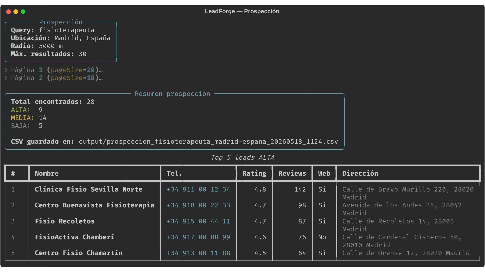

# LeadForge — Prospección B2B local (versión Community)


> Pipeline gratuito de prospección de leads B2B locales con Google Places API. Encuentra negocios por nicho + ubicación, los califica automáticamente y los deduplica entre búsquedas. Open source bajo MIT.

---

## 🎬 Demo



---

## ✨ Qué hace esta versión Community

- 🔍 **Búsqueda** en Google Places API (New): por nicho + ubicación, con paginación y `FieldMask` optimizado.
- 📊 **Scoring automático** ALTA/MEDIA/BAJA por rating + nº de reseñas.
- 🧹 **Deduplicación en cascada** entre múltiples búsquedas (teléfono → Google Maps URI → nombre + dirección).
- 📦 **CSV listo** para importar en Excel, Notion, Airtable o tu CRM.

---

## 🚀 Quickstart

```bash
# 1. Clona el repo
git clone https://github.com/TU-USUARIO/leadforge-public leadforge && cd leadforge

# 2. Setup automático: venv + dependencias + .env
bash setup.sh

# 3. Edita .env con tu Google Places API key
nano .env

# 4. Tu primera prospección
.venv/bin/python -m src.prospeccion \
    --query "fisioterapeuta" \
    --location "Madrid, España" \
    --max-results 30
```

El CSV aparece en `output/`. Guía paso a paso en [`docs/QUICKSTART.md`](docs/QUICKSTART.md).

---

## 💰 Coste de uso

Google Places API New: **~$0.12 / búsqueda de 60 leads**. Google da **$200/mes de crédito gratis** → ≈1.500 búsquedas/mes sin pagar nada. En la práctica, **gratis** para uso normal de un freelancer o agencia.

---

## 🆚 Community vs Pro

| Feature | Community | Pro |
|---|---|---|
| Prospección Google Places | ✅ | ✅ |
| Scoring básico ALTA/MEDIA/BAJA | ✅ | ✅ |
| Deduplicación inteligente | ✅ | ✅ |
| CLI con `rich` | ✅ | ✅ |
| **Auditoría web con Claude** | ❌ | ✅ |
| **Lighthouse integrado** | ❌ | ✅ |
| **Pitch personalizado IA** | ❌ | ✅ |
| **Plantilla email de venta** | ❌ | ✅ |
| **Documentación avanzada** | ❌ | ✅ |
| **Soporte por email (30 días)** | ❌ | ✅ |
| **Updates v1.x** | ❌ | ✅ |
| Licencia | MIT | Comercial |

👉 **[Conseguir LeadForge Pro — 29€](https://bermejowebs.com)** *(precio early-bird, limitado a las primeras 30 ventas)*.

---

## 📚 Documentación

- [Quickstart](docs/QUICKSTART.md) — De cero a tu primer CSV en 5 minutos
- [Configurar APIs](docs/CONFIGURACION_APIS.md) — Conseguir la API key de Google Places
- [Arquitectura](docs/ARQUITECTURA.md) — Cómo funciona, cómo extender
- [Casos de uso](docs/CASOS_DE_USO.md) — 5 nichos con queries listas para copiar
- [FAQ](docs/FAQ.md) — Coste, legalidad, errores comunes

---

## 📦 Stack

- **Python 3.10+**
- `httpx` — cliente HTTP
- `pandas` — normalización y dedupe
- `rich` — CLI con tablas y paneles
- `python-dotenv` — gestión de keys

API externa: **Google Places API (New)**.

---

## ⚖️ Licencia

[MIT](LICENSE) — uso libre, comercial y personal. Atribución apreciada pero no obligatoria.

---

## 🙋 Soporte

- 🐛 **Bugs y sugerencias de la Community**: GitHub Issues.
- 💬 **Soporte de la versión Pro**: [hola@bermejowebs.com](mailto:hola@bermejowebs.com).

---

## 👤 Autor

Diego Bermejo — data engineer construyendo herramientas técnicas útiles. Más en [bermejowebs.com](https://bermejowebs.com).
