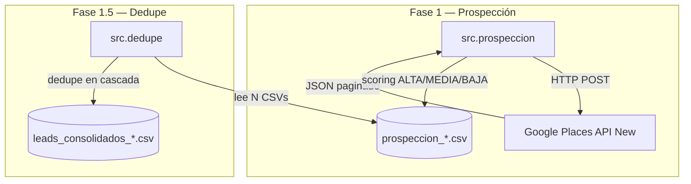

# Arquitectura

## Visión general

LeadForge Community es un **pipeline de 2 fases** desacopladas que se comunican por CSV. Cada fase es un módulo Python independiente, invocable con `python -m src.<modulo>`.



## Por qué CSV entre fases

- **Reanudable**: si un run se rompe a mitad, el CSV de la fase anterior sigue ahí.
- **Inspeccionable**: el usuario abre Excel/LibreOffice entre fases y filtra/edita manualmente si quiere.
- **Idempotente**: re-ejecutar una fase con el mismo input da el mismo output.
- **Sin estado en memoria**: no necesita base de datos.

Trade-off aceptado: para datasets >100k leads habría que pasar a Parquet o SQLite. Para el uso típico (10-1.000 leads por nicho), CSV es perfecto.

---

## Decisiones técnicas

### Google Places API **(New)**, no la antigua

La API antigua (`maps/api/place/textsearch/json`) se está descontinuando. La New (`places.googleapis.com/v1`) tiene:

- `FieldMask` obligatorio → control granular sobre qué se factura.
- Soporte nativo de paginación con `nextPageToken`.
- Mejor cobertura internacional.

Coste: **factura por campo solicitado**. Por eso `config.FIELD_MASK` pide solo los 9 campos que usamos.

### No scraping de Google Maps

Sería más barato pero:

- Es contra los ToS de Google.
- Cualquier cambio menor en su HTML rompe el scraper.
- Bloqueos por rate-limit / captcha.

Pagar la API es ~$0.12 por 60 leads. No merece la pena reinventar.

### Dedupe en cascada (teléfono → URI → nombre+dirección)

Tres criterios porque ningún campo es 100% fiable:

1. **Teléfono normalizado** (sin prefijo +34, sin espacios) → más fiable cuando existe.
2. **`googleMapsUri`** → único por Google Place ID, pero algunos negocios pequeños no tienen.
3. **Nombre + primera línea de dirección** → fallback para los sin teléfono ni URI.

Cuando dos filas son el mismo negocio, se conserva la de **mayor prioridad** (ALTA > MEDIA > BAJA), y a igualdad la de **más reseñas**.

---

## Cómo extender

### Cambiar criterios de scoring

`src/config.py`:

```python
SCORE_ALTA_MIN_RATING = 4.5
SCORE_ALTA_MIN_REVIEWS = 30
SCORE_MEDIA_MIN_RATING = 4.0
SCORE_MEDIA_MIN_REVIEWS = 10
```

Por ejemplo, para nichos con menos reseñas (abogados, consultoría B2B) baja `SCORE_ALTA_MIN_REVIEWS` a 10.

### Añadir nuevos data sources

Crea un nuevo módulo en `src/`, por ejemplo `src/instagram.py`, que:

1. Reciba un CSV consolidado.
2. Para cada lead, busque su perfil de Instagram y enriquezca con `followers`, `last_post_date`, etc.
3. Escriba un nuevo CSV `leads_enriquecidos_*.csv`.

La estructura está pensada para que cada fuente sea un módulo separado.

### Pasar a base de datos

Para >10.000 leads, sustituir `pd.read_csv` / `df.to_csv` por SQLite (`pd.read_sql` / `df.to_sql`) en los 2 módulos. Mantén el contrato de columnas y todo lo demás funciona igual.

---

## Limitaciones conocidas

- **`--radius` no se envía como `locationBias.circle`**: la API resuelve la ubicación desde el `textQuery`. Si necesitas radio estricto, geocodifica primero y modifica `search_places()` para pasar `locationBias.circle.center.{latitude,longitude}`.
- **Paginación**: la API New limita a 20 por página. El sleep de 2s entre páginas no es opcional (el token tarda en activarse).

---

> 💡 La versión Pro añade un pipeline de **Fase 2 — Auditoría** con Playwright (screenshots), PageSpeed Insights (Lighthouse) y Claude Sonnet 4.5 (análisis visual + pitch personalizado). Más info: [bermejowebs.com](https://bermejowebs.com).
